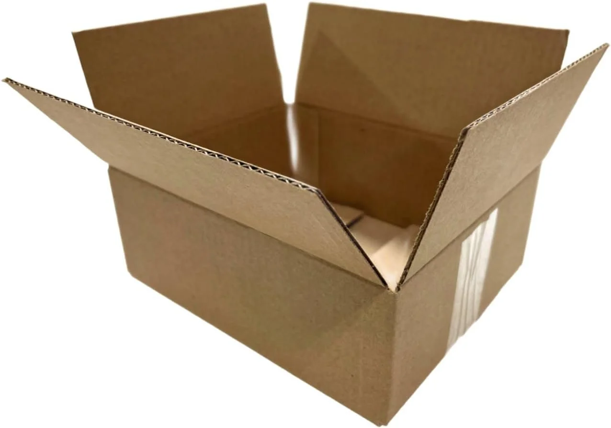
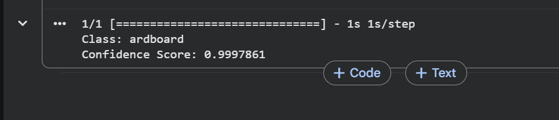

# Smart Waste Classifier

An image recognition project developed using **Google Teachable Machine**, **TensorFlow Keras**, and **Python** to classify different types of waste.

---

## Project Overview

This project demonstrates the complete workflow of building an image classification model. The model was trained using the **TrashNet** dataset, exported in **TensorFlow Keras (.h5)** format, and tested using a Python script in **Google Colab**.

---

## Dataset

- **Dataset:** TrashNet
- **Source:** Kaggle
- **Link:** https://www.kaggle.com/datasets/feyzazkefe/trashnet

The dataset contains six waste categories:

- Cardboard
- Glass
- Metal
- Paper
- Plastic
- Trash

---

## Technologies Used

- Google Teachable Machine
- TensorFlow Keras
- Python
- Google Colab

---

## Project Workflow

1. Downloaded the TrashNet dataset from Kaggle.
2. Uploaded the images to Google Teachable Machine.
3. Trained the image classification model.
4. Exported the model in TensorFlow Keras format.
5. Loaded the model using Python.
6. Tested the model with a new image.
7. Displayed the predicted class and confidence score.

---

## Project Files

- `predict.py` – Python prediction script
- `keras_model.h5` – Trained model
- `labels.txt` – Class labels
- `image.webp` – Test image
- `output.jpg` – Prediction result
- `Smart_Waste_Classifier_Project_Report.pdf` – Project documentation

---

## Test Image

  

## Prediction Result

  

The model successfully predicted the uploaded image as:

- **Predicted Class:** Cardboard
- **Confidence Score:** **99.98%**

---

## Author

**Raghad Alhamad**
